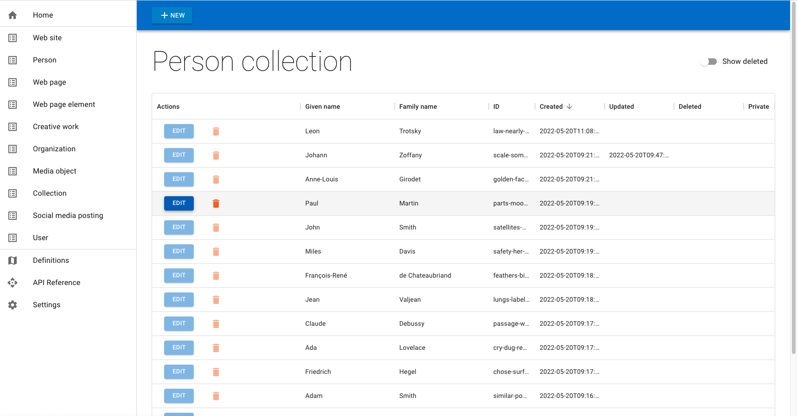
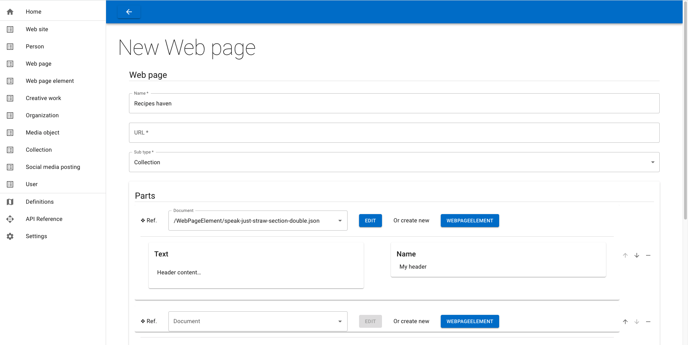
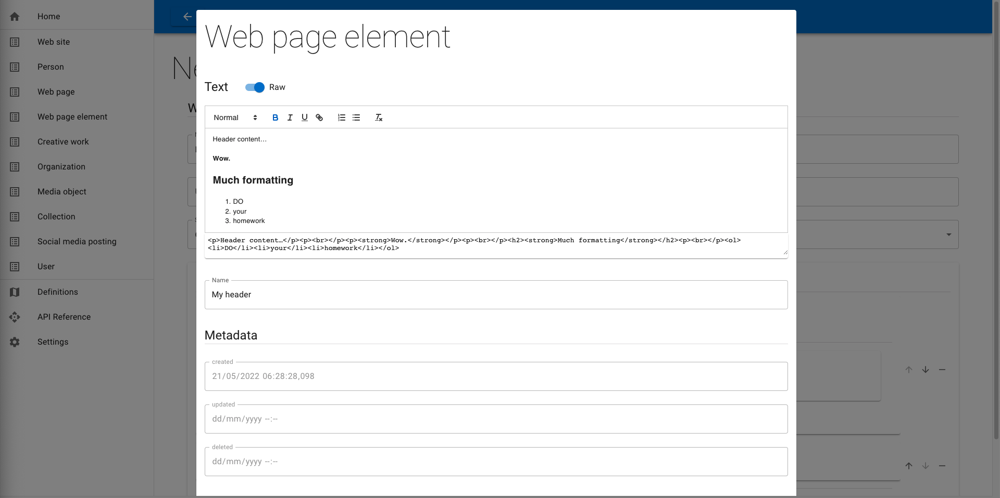

# 📑  Paper CMS  📝

A document-based headless CMS with API + back office.

Made primarly for editorial content management.  
Stock definitions are modelled after Schema.org vocabulary.

---

- [📑  Paper CMS  📝](#paper-cms)
- [🏁  Usage](#usage)
  - [Live demo](#live-demo)
  - [or… local quick start 📦](#or-local-quick-start-)
  - [or… with Docker Compose 🐳](#or-with-docker-compose-)
- [Some views  👀](#some-views)
- [❄️  Features](#️features)
  - [Auto-generated forms from OpenAPI definitions](#auto-generated-forms-from-openapi-definitions)
  - [JSON Schema validation on run-time for both client and server sides](#json-schema-validation-on-run-time-for-both-client-and-server-sides)
  - [UI Schema augmentation (non-standard)](#ui-schema-augmentation-non-standard)
  - [JSON files database](#json-files-database)
  - [Image(s) upload + dynamic resize while fetching + caching](#images-upload--dynamic-resize-while-fetching--caching)
  - [JWT authentication for both human editors and API consumers](#jwt-authentication-for-both-human-editors-and-api-consumers)
  - [Full live reload for models / client / server](#full-live-reload-for-models--client--server)
  - [Document revisions history](#document-revisions-history)
  - [Soft deletion, restore from trash](#soft-deletion-restore-from-trash)
  - ["Has many" relationship via references](#has-many-relationship-via-references)
  - [Nested referenced documents editing](#nested-referenced-documents-editing)
  - [Schema.org inspired default definitions](#schemaorg-inspired-default-definitions)
  - [OpenAPI 3 UI (Swagger)](#openapi-3-ui-swagger)
  - [Wysiwyg HTML Editor](#wysiwyg-html-editor)
  - [Custom fields and widgets](#custom-fields-and-widgets)
- [🤔  Why?](#why)
  - [Inspirations](#inspirations)
  - [Goals](#goals)
- [ℹ️  Project insights](#ℹ️project-insights)
  - [Structure](#structure)
  - [Major dependencies](#major-dependencies)
  - [Work in progress](#work-in-progress)
  - [To do](#to-do)
  - [Features ideas](#features-ideas)

---

# 🏁  Usage

## Live demo

**👉  [Check here](https://www.juliancataldo.com/apps/) for a Paper CMS online tryout.**  
🔁  *Default dataset is reseted periodically.*  
🔑  Use good ol' `admin` / `password`.

## or… local quick start 📦

```sh
# Clone this repo
git clone git@github.com:JulianCataldo/paper-cms.git
cd paper-cms
code ./

# Install all dependencies
npm run deps:i

# Run and watch API + back office
npm run dev

# Open back office in browser
open http://localhost:7777

# Default credentials
# > User : `admin`
# > Password : `password`

# Edit API definition
code -r ./models/api-v1.yaml

# Created entries and uploaded medias + variations
# are stored in root project by default in `.data`
tree ./.data
```

## or… with Docker Compose 🐳

```sh
cd ./docker
make dcu-std

-
# Data persistence folder
tree ./docker/std/.volume/.data
```

# Some views  👀





# ❄️  Features

## Auto-generated forms from OpenAPI definitions

https://user-images.githubusercontent.com/603498/169503745-7be7124c-5d47-4170-85fb-e32d4ada58bd.mp4

## JSON Schema validation on run-time for both client and server sides

https://user-images.githubusercontent.com/603498/169630848-7ca3a1b8-dcd1-4787-a11e-66603b843fb4.mp4

---

Browser and everything in between cannot be trusted for data transmission.  
In Paper CMS, both sides are taken care of, thanks to AJV and JSON Schema specs.

For example, you might need to do manual data transformation, directly on entry files, skipping the back-office.  
_Use cases : search and replace, refactoring fields names, automatic external data ingestion…_  
Everytime a file is read OR written, it will pass through schema validation, so no silent models shifting while refactoring them.
`additionalProperties: false` can be leveraged to be warn about orphaned fields.

## UI Schema augmentation (non-standard)

https://user-images.githubusercontent.com/603498/169630096-ce777a5d-15ad-41d7-9360-aea9791d7616.mp4

---

Pure JSON Schema isn't designed (yet?) for declarative UI parameters.  
Special dialects to cater for this are experimented here and here.  
In Paper CMS, we're using `react-jsonschema-form` so see  
➠ [General uiSchema Reference - react-jsonschema-form documentation](https://react-jsonschema-form.readthedocs.io/en/latest/api-reference/uiSchema/)

Settings are splitted in two different schemas at runtime.  
Standard compliant JSON Schema alongside non standard UI Schema.

## JSON files database

All your textual data is hosted unded `./data/docs` (root can be overriden with `DATA_DIR`).  
Run multiple instances of Paper CMS easily by setting different `PORT`.  
Quickly swip datasets : demo / tests / staging / production…

## Image(s) upload + dynamic resize while fetching + caching

…

## JWT authentication for both human editors and API consumers

https://user-images.githubusercontent.com/603498/169494704-6ee7afcb-31f5-4cc5-b126-e109bd24606f.mp4

## Full live reload for models / client / server

When editing **model** definitions, **server** or **client** code, everything is re-runs / re-builded
and browser is automatically refreshed, thanks to a long polling web socket.

You can also trigger browser refresh by hitting `curl localhost:${PORT:-7777}/reload`.

## Document revisions history

…

## Soft deletion, restore from trash

…

## "Has many" relationship via references

https://user-images.githubusercontent.com/603498/169636447-e2b891c9-90dc-4603-9832-256ed09653ca.mp4

---

When using an array of items for a property, and thanks to a special:  
`'ui:field': 'hyperlink'`  
combined with a:  
`pattern: '/(Person|Organization|Whatever)/(.*).json'`  
you will get an "has-many" heterogeneous references dynamic widget.  
See the `api-v1.yaml` for full examples.

## Nested referenced documents editing

A "sub" document is just another document reference.  
There is no hierarchy or inheritance,
only cross-references betweens entities.  
While you can create, edit or associate an existing document from the main document form,
only `$refs` URI for child references actually gets recorded, not the entire subtree.

Everything can be a document collection, as soon as it make sense to reference
the entity from elsewhere. Self-sufficient data should live embedded
in the document itself.

There is no limit for nesting, though stacked modal editors force us
to save only one (sub)document at a time: no full tree update propagation.
This design choice is meant to prevent data-loss / infinite recursive nesting.

## Schema.org inspired default definitions

While [Schema.org](https://schema.org/docs/datamodel.html) states that:

> The type hierarchy presented on this site is not intended to be a 'global ontology' of the world.

While true, it provides a great starting point with commonly used taxonomies and entities relationships.  
Schema.org is shining for content-driven web sites where SEO is crucial (but that's just an excuse).  
While still in its infancy, JSON/LD is already bringing [HATEOS](https://en.wikipedia.org/wiki/HATEOAS) concepts
into real-life applications, step-by-step, organically.  
Regardless, feature-rich widgets are democratizing, and data crawling between third-parties is becoming more insightful.

## OpenAPI 3 UI (Swagger)

The endgoal is to make Paper CMS a non-deterministic data ingestion / organization / retrieval
system.  
At the end, an hypermedia API should be auto-discoverable.  
Still, it's useful to rely on Swagger niceties for on-boarding an API.  
Moreover, the OpenAPI 3 specs is adding `links`, a notable concept for [Hypermedia minded APIs](https://swagger.io/docs/specification/links/).

## Wysiwyg HTML Editor

https://user-images.githubusercontent.com/603498/169635232-eff07d67-4336-491a-8221-c60d79678e8c.mp4

---

For rich text editing, Paper CMS uses [Quill](https://github.com/quilljs/quill) under the hood.  
Basic additional HTML sanitization is done server-side.

## Custom fields and widgets

…

# 🤔  Why?

## Inspirations

We are seeing the emergence of different patterns in the content management
world like:

- Shared entities vocabularies
- Automatic web form generation
- Isomorphic user input runtime validation,
- Entity / Collection oriented information architecture
- Headless non-opinionated CMS APIs for JAMStack consumption
- Hypermedia for non-deterministic data fetching via _refs. | links | URIs_…
- Plain files data storage for operations convenience (with some trade-offs)
- Conventions over configuration, with extendabilities (models, widgets…)

## Goals

All these concepts are explored at different levels of implementations
in Paper CMS.  
While it's still an experiment, the end-goal is to provide a lightweight
solution suitable for projects which:

- Has ten-ish max. editors in charge
- Needs moderate authoring concurrency with silo-ed document edits
- Might needs frequent content updates
- Low needs for user-land data input
- Are in an eco-system of focused services where caching / CDNs / whatever are dedicated

To sum up: Paper CMS is good for **editors-driven web sites**, but is not a
good fit for **users-driven web apps**.

# ℹ️  Project insights

> ⚠️ Work in progress: **NOT FOR PRODUCTION** ⚠️

## Structure

Mono-repo. glued with PNPM recursive modules installation.

## Major dependencies

- Node.js
- ESBuild
- React
- MUI
- React Quill
- JSON Schema React
- AJV
- Express
- Sharp

## Work in progress

- Single media management
- Batch media management
- JSON/LD API output conformance
- OpenAPI conformance
- Swagger integration
- Wider Schema.org support for stock definitions
- Basic users account management

## To do

- Media metadata with EXIF + IPTC support
- API collections' pagination
- Automatic bi-directional relationships ("Is part of many" <=> "Has many")
- Custom data fetching and population widgets for APIs / social networks content retrieval

## Features ideas

- Might propose fully dynamic OpenAPI GUI builder right inside the back office,
  instead OR alongside YAML config.
- Might propose MongoDB/pSQL/S3 alternative to bare file storage,
  for increased **mass** and/or **concurrency** needs,
  but decreased portability.
- Might propose an option for storing media binaries in an S3 bucket.

---

```powershell

    ,ggggggggggg,
    dP""88""""""Y8,
    Yb, 88      `8b
    `"  88      ,8P
        88aaaad8P"
        88""""",gggg,gg  gg,gggg,     ,ggg,    ,gggggg,
        88    dP"  "Y8I  I8P"  "Yb   i8" "8i   dP""""8I
        88   i8'    ,8I  I8'    ,8i  I8, ,8I  ,8'    8I
        88  ,d8,   ,d8b,,I8 _  ,d8'  `YbadP' ,dP     Y8,
        88  P"Y8888P"`Y8PI8 YY88888P888P"Y8888P      `Y8
                          I8
                          I8       ,gggg,   ,ggg, ,ggg,_,ggg,        ,gg,
                          I8     ,88"""Y8b,dP""Y8dP""Y88P""Y8b      i8""8i
                          I8    d8"     `Y8Yb, `88'  `88'  `88      `8,,8'
                          I8   d8'   8b  d8 `"  88    88    88       `88'
                          I8  ,8I    "Y88P'     88    88    88       dP"8,
                              I8'               88    88    88      dP' `8a
                              d8                88    88    88     dP'   `Yb
                              Y8,               88    88    88 _ ,dP'     I8
                              `Yba,,_____,      88    88    Y8,"888,,____,dP
                                `"Y8888888      88    88    `Y8a8P"Y88888P"

```

👉  [www.JulianCataldo.com](https://www.juliancataldo.com)
